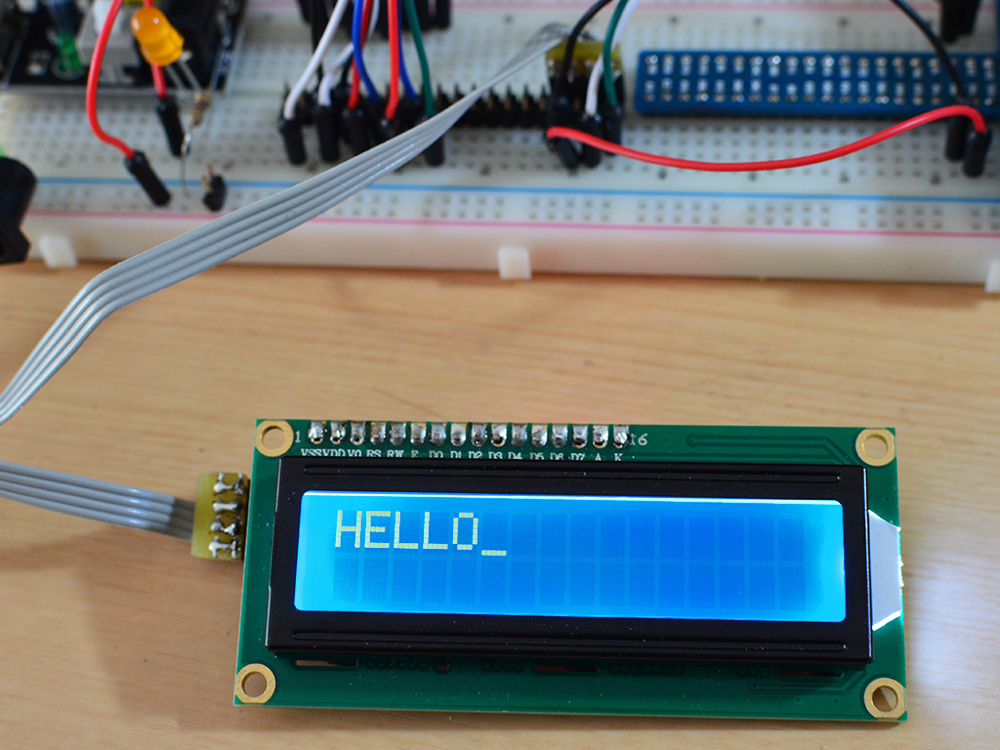
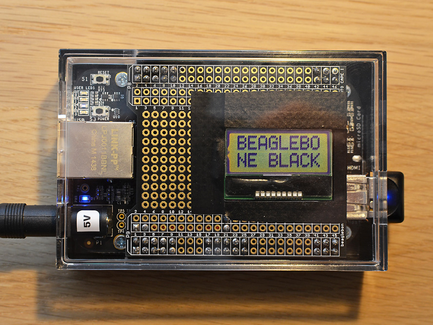
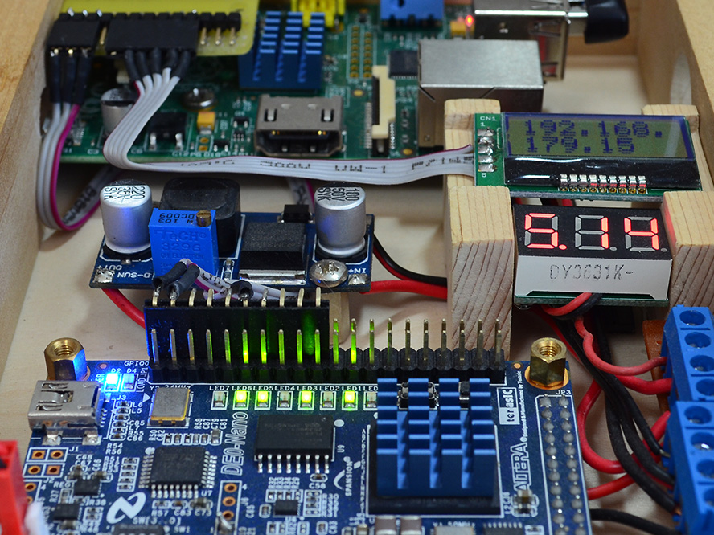

# i2c-lcd

## HD44870 character LCD display via PCF8574 backpack module

<a href="https://github.com/fm4dd/i2c-lcd/blob/master/pcf8574-lcd-demo.c">pcf8574-lcd-demo.c</a> is example C code how to drive a standard HD44870 character LCD display over a I2C-connected PCF8574-based backpack module.
Tested on a Raspberry Pi 3.

## 2x8 mini-LCD type AQM0802 over I2C

Remanining code is a set of LCD programs that drive a mini-LCD type AQM0802 over the I2C bus of embedded systems. This includes popular devices like the BeagleBone Black, or the Raspberry Pi. The C code is based  on a previous embedded C library for [HD44780-based character LCD](https://github.com/fm4dd/hd44780lcd-lib).

The AQM0802 2x8 character LCD is a downsized module that fits the scale of credit-card-sized boards, and can provide output of critical paramaters, such as the current WiFi DHCP address assignment.

Beaglebone Black example, using a prototype cape:

See also http://blog.fm4dd.com/?p=896

Interfacing the AQM0802 LCD display with a Raspberry Pi:

